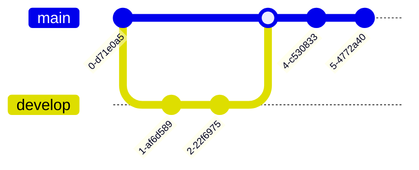

irthomasthomas: Generate a markdown doc with examples of every type of mermaid diagram supported.

GitHub Copilot: # Mermaid Diagram Examples

This document provides examples of all supported Mermaid diagram types with sample code and rendered output.

## 1. Flowchart

Flowcharts are diagrams that represent workflows or processes.


## 2. Sequence Diagram

Sequence diagrams show how processes operate with one another and in what order.


## 3. Class Diagram

Class diagrams show the structure of a system by displaying classes, attributes, methods, and relationships.


## 4. State Diagram

State diagrams describe the behavior of a system, showing state transitions.


## 5. Entity Relationship Diagram

ER diagrams show relationships between entities in a database.


## 6. User Journey Diagram

User journey diagrams visualize the user's experience with a product or service.


## 7. Gantt Chart

Gantt charts illustrate project schedules with tasks displayed against time.


## 8. Pie Chart

Pie charts represent data as slices of a circle.


## 9. Git Graph

Git graphs visualize Git commit history and branching.



## 10. Requirement Diagram

Requirement diagrams document system requirements and their relationships.


## 11. C4 Diagram

C4 diagrams model the architecture of software systems.


## 12. Mindmap

Mindmaps are diagrams used to visually organize information.


## 13. Timeline

Timelines visualize a chronological sequence of events.


## 14. Quadrant Chart

Quadrant charts divide data into four sections for analysis.


## 15. Sankey Diagram

Sankey diagrams visualize flow and quantities in a system.


## 16. Block Diagram
Block diagrams represent systems and their components.


## 17. Flowchart with Subgraphs
Flowcharts with subgraphs allow for grouping related nodes.


## 18. XY Chart
XY charts visualize data points in a two-dimensional space.


## 19. Code Smell Visualization

Code smell visualizations highlight problematic areas in code using Mermaid diagrams. These diagrams can help developers understand structural issues and areas for improvement.

### Example: Class Diagram with Code Smells


### Example: Flowchart with Code Smells


### Example: State Diagram with Code Smells

```mermaid
stateDiagram-v2
    [*] --> Idle
    Idle --> Processing : start()
    Processing --> Idle : stop()
    Processing --> Error : fail()
    Error --> [*]

    %% Highlighting code smells
    state Processing {
        %% Code Smell: Long Method
        %% Reason: Too many transitions
    }
```